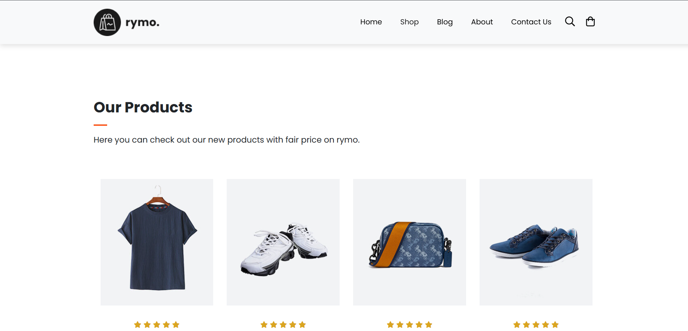
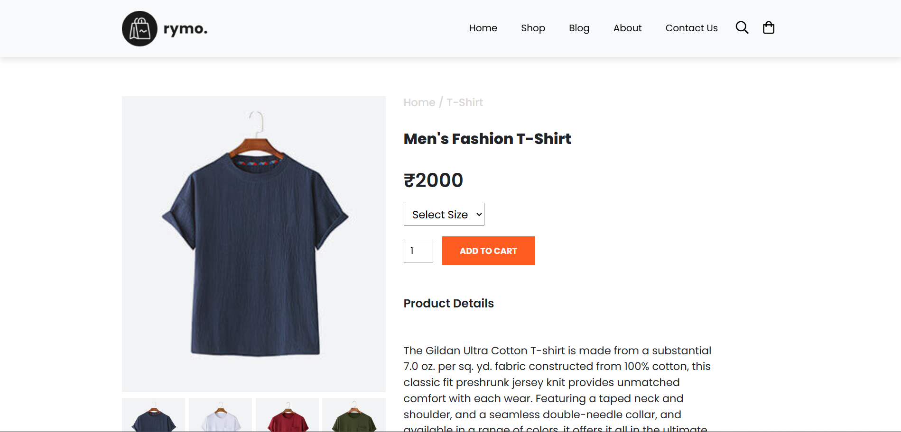
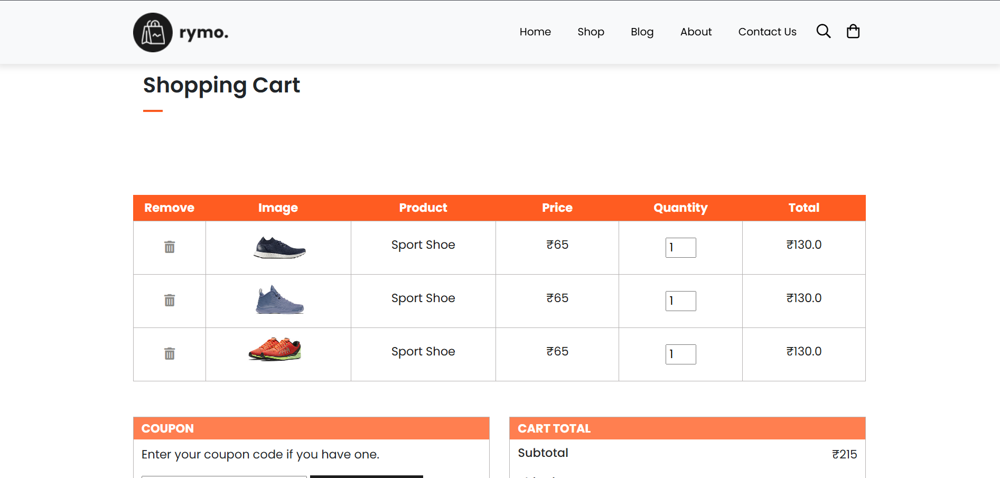
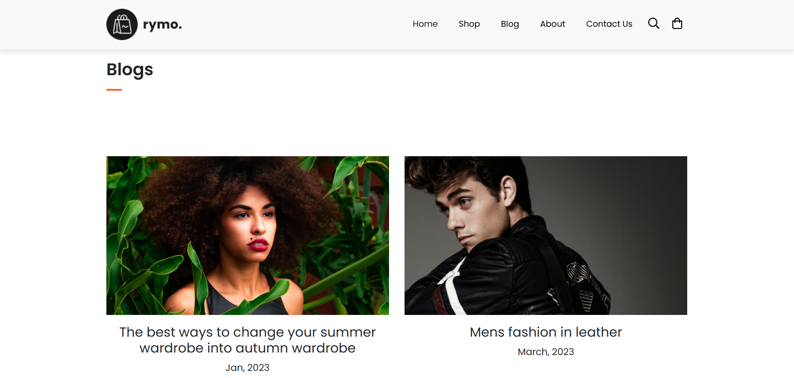

# 🛒 E-commerce Website (Static)

A clean and responsive front-end UI for an e-commerce website built using **HTML** and **CSS**. This project focuses purely on the layout and visual design of an online store, with plans to add interactivity using JavaScript in the future.

---

## 🚀 Features

- 🖼️ Product listing with image, name, and price
- 🛒 "Add to Cart" button UI (non-functional)
- 📱 Responsive design using Flexbox/Grid
- 🎨 Stylish homepage, navigation bar, and footer
- ✨ Hover effects and visual transitions for better UX

---

## 🛠️ Tech Stack

- **HTML5** – Semantic structure
- **CSS3** – Styling and responsive layout (Flexbox, Grid)

---

## 📸 Screenshots

### 🏠 Homepage

### 🛍️ Shop Page

### 📄 Single Product Page

### 🛒 Cart Page

### 📝 Blog Page

---

## 🌐 Live Demo

> Visit the deployed website here:  
[🔗 View Live Site](https://smith-droid.github.io/ecommerce-website/) 

---

## 📚 What I Learned

- Building scalable multi-page layouts in HTML/CSS
- Structuring front-end projects with semantic HTML and organized assets
- Creating responsive designs with CSS Flexbox and Grid

---

## 👨‍💻 Author

- **Name**: Smith Popat
- **GitHub**: [Smith-droid](https://github.com/Smith-droid)

